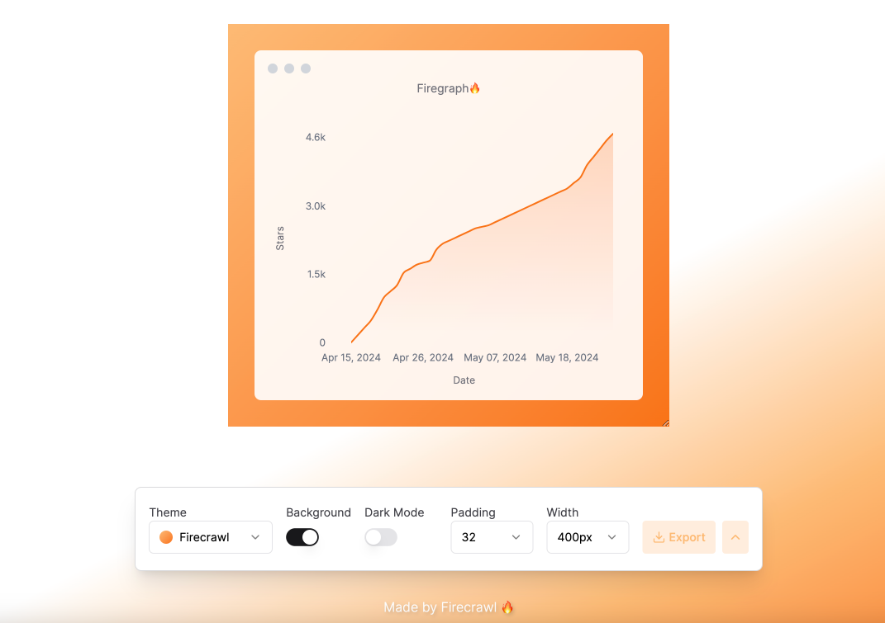

# Firegraph 🔥

Creating beautiful and interactive graphs with Firegraph. Created by [Firecrawl](https://github.com/mendableai/firecrawl). Start with by plotting GitHub stars or your own CSV data.

## Features

- **Interactive Graphs**: Create graphs that users can interact with.
- **Customizable Themes**: Choose from a variety of themes to match your style.
- **Real-time Data**: Integrate real-time data to keep your graphs up-to-date.
- **Easy to Use**: User-friendly interface that makes graph creation simple and quick.

